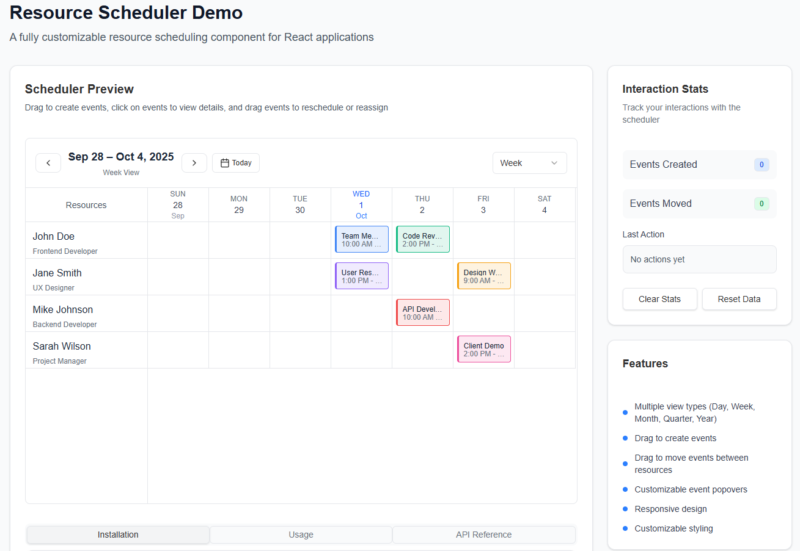

# Resource Scheduler

A fully customizable, feature-rich resource scheduling component for React applications. Built with TypeScript, Tailwind CSS, and shadcn/ui components.



## Live Demo And Documentation

Try the Resource Scheduler in action: [resource-scheduler-demo.vercel.app](https://resource-scheduler-demo.vercel.app/)

## Features

- 📅 **Multiple View Types**: Day, Week, Month, Quarter, and Year views
- 🎯 **Drag & Drop**: Create events by dragging and move events between resources
- 🎨 **Customizable**: Fully customizable styling and event rendering
- 📱 **Responsive**: Works seamlessly across desktop and mobile devices
- ♿ **Accessible**: Built with accessibility best practices
- 🎪 **Event Popovers**: Customizable event detail popovers
- 📊 **Resource Management**: Manage multiple resources with individual events
- 🎯 **TypeScript**: Fully typed for better developer experience

## Installation

```bash
npm install resource-scheduler
# or
yarn add resource-scheduler
# or
pnpm add resource-scheduler
```

## Quick Start

```tsx
import { ResourceScheduler, ViewType } from 'resource-scheduler';
import "resource-scheduler/dist/resource-scheduler.css"
import { useState } from 'react';

function App() {
  const [resources, setResources] = useState([
    {
      id: "1",
      name: "John Doe",
      role: "Developer",
      events: [
        {
          id: "e1",
          startDate: new Date("2025-09-10T10:00:00"),
          endDate: new Date("2025-09-10T12:00:00"),
          title: "Team Meeting",
          color: "#3b82f6",
          description: "Weekly sync"
        },
      ],
    },
  ]);

  const handleEventCreate = (eventData, resourceId) => {
    const newEvent = {
      ...eventData,
      id: `event-${Date.now()}`,
    };
    
    setResources(prev => 
      prev.map(resource => 
        resource.id === resourceId 
          ? { ...resource, events: [...resource.events, newEvent] }
          : resource
      )
    );
  };

  return (
    <div style={{ height: '600px' }}>
      <ResourceScheduler
        resources={resources}
        initialView={ViewType.Week}
        onEventCreate={handleEventCreate}
      />
    </div>
  );
}
```

## Styles
Import the default styles in your main CSS or JS file:

```tsx
import "resource-scheduler/dist/resource-scheduler.css"
```
## Contributing

We welcome contributions! Please see our [Contributing Guide](CONTRIBUTING.md) for details.

### Development Setup

```bash
# Clone the repository
git clone https://github.com/mdobaid311/resource-scheduler.git

# Install dependencies
npm install

# Start development server
npm run dev

# Build the package
npm run build

# Run tests
npm test
```

## License

MIT License - see the [LICENSE](LICENSE) file for details.

## Support

- 📚 [Documentation](https://resource-scheduler-demo.vercel.app/)
- 🐛 [Bug Reports](https://github.com/mdobaid311/resource-scheduler/issues)
- 💡 [Feature Requests](https://github.com/mdobaid311/resource-scheduler/issues)
- 💬 [Discussions](https://github.com/mdobaid311/resource-scheduler/discussions)

## Acknowledgments

- Built with [React](https://reactjs.org/)
- Styled with [Tailwind CSS](https://tailwindcss.com/)
- UI components from [shadcn/ui](https://ui.shadcn.com/)
- Date utilities from [date-fns](https://date-fns.org/)
- Drag & drop with [React DnD](https://react-dnd.github.io/react-dnd/)

---

**Resource Scheduler** - Efficiently manage and schedule your resources with this powerful React component.