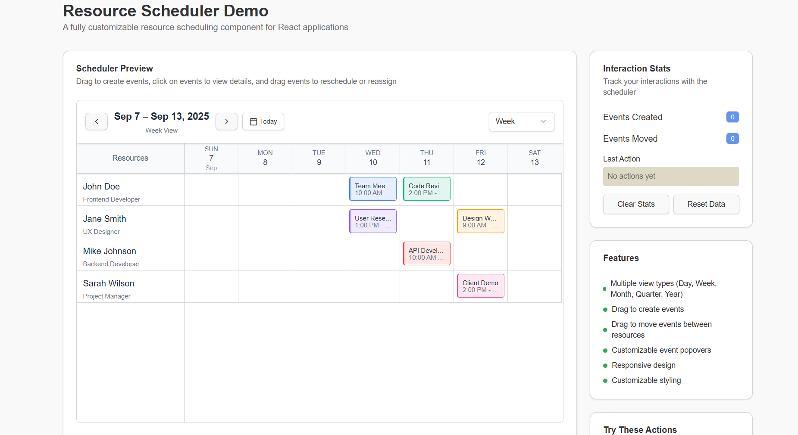

# Resource Scheduler

A fully customizable, feature-rich resource scheduling component for React applications. Built with TypeScript, Tailwind CSS, and shadcn/ui components.



## Features

- 📅 **Multiple View Types**: Day, Week, Month, Quarter, and Year views
- 🎯 **Drag & Drop**: Create events by dragging and move events between resources
- 🎨 **Customizable**: Fully customizable styling and event rendering
- 📱 **Responsive**: Works seamlessly across desktop and mobile devices
- ♿ **Accessible**: Built with accessibility best practices
- 🎪 **Event Popovers**: Customizable event detail popovers
- 📊 **Resource Management**: Manage multiple resources with individual events
- 🎯 **TypeScript**: Fully typed for better developer experience

## Installation

```bash
npm install resource-scheduler
# or
yarn add resource-scheduler
# or
pnpm add resource-scheduler
```

## Peer Dependencies

This package requires the following peer dependencies:

```bash
npm install react react-dom tailwindcss date-fns
```

## Quick Start

```tsx
import { ResourceScheduler, ViewType } from 'resource-scheduler';
import "resource-scheduler/dist/resource-scheduler.css"
import { useState } from 'react';

function App() {
  const [resources, setResources] = useState([
    {
      id: "1",
      name: "John Doe",
      role: "Developer",
      events: [
        {
          id: "e1",
          startDate: new Date("2025-09-10T10:00:00"),
          endDate: new Date("2025-09-10T12:00:00"),
          title: "Team Meeting",
          color: "#3b82f6",
          description: "Weekly sync"
        },
      ],
    },
  ]);

  const handleEventCreate = (eventData, resourceId) => {
    const newEvent = {
      ...eventData,
      id: `event-${Date.now()}`,
    };
    
    setResources(prev => 
      prev.map(resource => 
        resource.id === resourceId 
          ? { ...resource, events: [...resource.events, newEvent] }
          : resource
      )
    );
  };

  return (
    <div style={{ height: '600px' }}>
      <ResourceScheduler
        resources={resources}
        initialView={ViewType.Week}
        onEventCreate={handleEventCreate}
      />
    </div>
  );
}
```

## Styles
Import the default styles in your main CSS or JS file:

```tsx
import "resource-scheduler/dist/resource-scheduler.css"
```

## Props

### ResourceSchedulerProps

| Prop | Type | Default | Description |
|------|------|---------|-------------|
| `resources` | `Resource[]` | **Required** | Array of resources to display |
| `initialDate` | `Date` | `new Date()` | Initial date to display |
| `initialView` | `ViewType` | `ViewType.Day` | Initial view type |
| `onEventClick` | `(event: Event, resource: Resource) => void` | `undefined` | Callback when event is clicked |
| `onDateChange` | `(date: Date) => void` | `undefined` | Callback when date changes |
| `onViewChange` | `(view: ViewType) => void` | `undefined` | Callback when view type changes |
| `onEventCreate` | `(event: Omit<Event, "id">, resourceId: string) => void` | `undefined` | Callback when new event is created |
| `onEventDrop` | `(event: Event, fromResourceId: string, toResourceId: string, newStartDate: Date, newEndDate: Date) => void` | `undefined` | Callback when event is moved |
| `renderEventPopover` | `(event: Event, resource: Resource, closePopover: () => void) => React.ReactNode` | `undefined` | Custom event popover renderer |
| `resourceColumnWidth` | `string` | `"220px"` | Width of resource column |
| `timeColumnWidth` | `string` | `"90px"` | Width of time columns (day view) |
| `dateColumnWidth` | `string` | `"140px"` | Width of date columns (other views) |
| `allowViewChange` | `boolean` | `true` | Whether to show view type selector |

### Type Definitions

```typescript
enum ViewType {
  Day = "day",
  Week = "week",
  Month = "month",
  Quarter = "quarter",
  Year = "year"
}

interface Resource {
  id: string;
  name: string;
  role?: string;
  events: Event[];
}

interface Event {
  id: string;
  title: string;
  startDate: Date;
  endDate: Date;
  color: string;
  description?: string;
}
```

## Usage Examples

### Basic Usage

```tsx
import { ResourceScheduler, ViewType } from 'resource-scheduler';

function BasicExample() {
  const resources = [
    {
      id: "1",
      name: "Resource 1",
      events: [
        {
          id: "1",
          title: "Meeting",
          startDate: new Date(),
          endDate: new Date(Date.now() + 2 * 60 * 60 * 1000),
          color: "#3b82f6"
        }
      ]
    }
  ];

  return (
    <ResourceScheduler
      resources={resources}
      initialView={ViewType.Week}
    />
  );
}
```

### With Event Handlers

```tsx
function InteractiveExample() {
  const [resources, setResources] = useState(initialResources);

  const handleEventCreate = (eventData, resourceId) => {
    const newEvent = {
      ...eventData,
      id: `event-${Date.now()}`,
    };
    
    setResources(prev => 
      prev.map(resource => 
        resource.id === resourceId 
          ? { ...resource, events: [...resource.events, newEvent] }
          : resource
      )
    );
  };

  const handleEventDrop = (event, fromResourceId, toResourceId, newStartDate, newEndDate) => {
    // Remove from original resource
    const updatedResources = resources.map(resource => 
      resource.id === fromResourceId 
        ? { ...resource, events: resource.events.filter(e => e.id !== event.id) }
        : resource
    );
    
    // Add to new resource
    const finalResources = updatedResources.map(resource =>
      resource.id === toResourceId
        ? { ...resource, events: [...resource.events, { ...event, startDate: newStartDate, endDate: newEndDate }] }
        : resource
    );
    
    setResources(finalResources);
  };

  return (
    <ResourceScheduler
      resources={resources}
      onEventCreate={handleEventCreate}
      onEventDrop={handleEventDrop}
      onEventClick={(event, resource) => console.log('Event clicked', event)}
      onViewChange={(view) => console.log('View changed', view)}
    />
  );
}
```

### Custom Event Popover

```tsx
function CustomPopoverExample() {
  const renderEventPopover = (event, resource, closePopover) => (
    <div className="p-4 space-y-2">
      <h3 className="font-bold">{event.title}</h3>
      <p>{resource.name} - {resource.role}</p>
      <p>{event.startDate.toLocaleString()} - {event.endDate.toLocaleString()}</p>
      <button onClick={closePopover}>Close</button>
    </div>
  );

  return (
    <ResourceScheduler
      resources={resources}
      renderEventPopover={renderEventPopover}
    />
  );
}
```

## Styling

### Tailwind CSS

The component uses Tailwind CSS for styling. Make sure to include Tailwind in your project:

```css
/* In your main CSS file */
@tailwind base;
@tailwind components;
@tailwind utilities;
```

### Custom Styling

You can customize the appearance using the provided CSS variables or by overriding Tailwind classes:

```css
:root {
  --resource-scheduler-border: #d1d5db;
  --resource-scheduler-bg: #ffffff;
  /* Add more custom variables as needed */
}
```

## Responsive Design

The scheduler is fully responsive and adapts to different screen sizes:

- **Desktop**: Full feature set with optimal spacing
- **Tablet**: Compact layout with adjusted column widths
- **Mobile**: Horizontal scrolling with touch-friendly interactions

## Browser Support

- Chrome 90+
- Firefox 88+
- Safari 14+
- Edge 90+

## Contributing

We welcome contributions! Please see our [Contributing Guide](CONTRIBUTING.md) for details.

### Development Setup

```bash
# Clone the repository
git clone https://github.com/your-username/resource-scheduler.git

# Install dependencies
npm install

# Start development server
npm run dev

# Build the package
npm run build

# Run tests
npm test
```

## License

MIT License - see the [LICENSE](LICENSE) file for details.

## Support

- 📚 [Documentation](https://github.com/your-username/resource-scheduler/docs)
- 🐛 [Bug Reports](https://github.com/your-username/resource-scheduler/issues)
- 💡 [Feature Requests](https://github.com/your-username/resource-scheduler/issues)
- 💬 [Discussions](https://github.com/your-username/resource-scheduler/discussions)

## Changelog

### v1.0.0
- Initial release
- Multiple view types (Day, Week, Month, Quarter, Year)
- Drag & drop event creation and movement
- Customizable event popovers
- Responsive design
- TypeScript support

## Acknowledgments

- Built with [React](https://reactjs.org/)
- Styled with [Tailwind CSS](https://tailwindcss.com/)
- UI components from [shadcn/ui](https://ui.shadcn.com/)
- Date utilities from [date-fns](https://date-fns.org/)
- Drag & drop with [React DnD](https://react-dnd.github.io/react-dnd/)

---

**Resource Scheduler** - Efficiently manage and schedule your resources with this powerful React component.