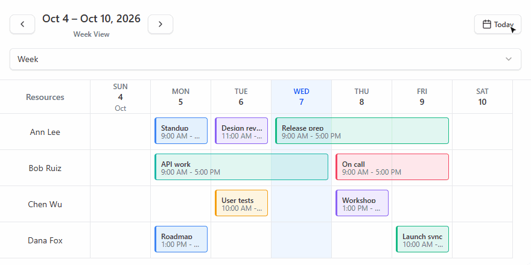

<h1 align="center">Resource Scheduler</h1>

<p align="center">
  A free, MIT-licensed <b>resource timeline for React</b>.<br />
  Drag, resize, stop double booking, and drive it from the keyboard.
</p>

<p align="center">
  <a href="https://www.npmjs.com/package/resource-scheduler"></a>
  <a href="https://github.com/mdobaid311/resource-scheduler/actions/workflows/ci.yml"></a>
  <a href="https://github.com/mdobaid311/resource-scheduler/blob/main/resource-scheduler/LICENSE"></a>
  
</p>

<p align="center">
  <a href="https://resource-scheduler-demo.vercel.app/"><b>Docs and live demos</b></a> &middot;
  <a href="#installation">Install</a> &middot;
  <a href="https://github.com/mdobaid311/resource-scheduler/blob/main/ROADMAP.md">Roadmap</a>
</p>

<p align="center">
  
</p>

## Why this one?

In most calendar libraries the resource timeline is a paid tier. Here it is free, and complete:

| Resource timeline | Cost |
|---|---|
| **Resource Scheduler** | Free, MIT. Drag, resize, conflict rules, slot selection and keyboard support all included |
| FullCalendar | Premium add-on, from $480 per developer |
| MUI X Scheduler | The Event Timeline is Premium |
| DayPilot Lite | Free, but resource hierarchy, keyboard navigation and overlap prevention are Pro only (Pro from $649) |

Prices checked October 2026; see the [full comparison](https://resource-scheduler-demo.vercel.app/compare/alternatives/). It is also younger than they are: there is no resource hierarchy or time zone support yet, and only rows are virtualized, so for very large timelines pick a heavier tool.

## Features

- 📅 **Views**: day, week, month, quarter and year. Day view slots of 15, 30 or 60 minutes, with visible hours
- 🖱️ **Create, move, resize**: mouse, pen or touch, using Pointer Events, so no drag-and-drop library to wire up
- 🚫 **Conflict rules**: `eventOverlap` and `isValidDrop`, a red footprint before you drop, and the same check available for your server
- 🧩 **Your own dialogs**: `onSlotSelect` hands you the range instead of a hard-coded "New Event"
- ⌨️ **Keyboard and screen readers**: ARIA grid, keyboard move, resize and create, live announcements
- 🎨 **Themeable and isolated**: `--rs-*` CSS variables, dark mode, and styles that never touch the rest of your app
- 📦 **Two ways to install**: npm, or copy the source into your project with the shadcn CLI
- 🔷 **TypeScript** types included; React 18 and 19; Next.js ready

## Installation

```bash
npm install resource-scheduler
# or
yarn add resource-scheduler
# or
pnpm add resource-scheduler
```

Or copy the source into your project with the [shadcn CLI](https://ui.shadcn.com/docs/registry/github) (Tailwind v4):

```bash
npx shadcn@latest add mdobaid311/resource-scheduler/resource-scheduler
```

## Quick Start

```tsx
import { ResourceScheduler, ViewType } from 'resource-scheduler';
import "resource-scheduler/dist/resource-scheduler.css"
import { useState } from 'react';

function App() {
  const [resources, setResources] = useState([
    {
      id: "1",
      name: "John Doe",
      role: "Developer",
      events: [
        {
          id: "e1",
          startDate: new Date("2025-09-10T10:00:00"),
          endDate: new Date("2025-09-10T12:00:00"),
          title: "Team Meeting",
          color: "#3b82f6",
          description: "Weekly sync"
        },
      ],
    },
  ]);

  const handleEventCreate = (eventData, resourceId) => {
    const newEvent = {
      ...eventData,
      id: `event-${Date.now()}`,
    };
    
    setResources(prev => 
      prev.map(resource => 
        resource.id === resourceId 
          ? { ...resource, events: [...resource.events, newEvent] }
          : resource
      )
    );
  };

  return (
    <div style={{ height: '600px' }}>
      <ResourceScheduler
        resources={resources}
        initialView={ViewType.Week}
        onEventCreate={handleEventCreate}
      />
    </div>
  );
}
```

## Styles
Import the default styles in your main CSS or JS file:

```tsx
import "resource-scheduler/dist/resource-scheduler.css"
```
## Contributing

We welcome contributions! Please see our [Contributing Guide](CONTRIBUTING.md) for details.

### Development Setup

```bash
# Clone the repository
git clone https://github.com/mdobaid311/resource-scheduler.git
cd resource-scheduler/resource-scheduler

# Install dependencies
npm install

# Start development server
npm run dev

# Build the package
npm run build

# Run tests
npm test
```

## License

MIT License - see the [LICENSE](LICENSE) file for details.

## Support

- 📚 [Documentation](https://resource-scheduler-demo.vercel.app/)
- 🐛 [Bug Reports](https://github.com/mdobaid311/resource-scheduler/issues)
- 💡 [Feature Requests](https://github.com/mdobaid311/resource-scheduler/issues)
- 💬 [Discussions](https://github.com/mdobaid311/resource-scheduler/discussions)

## Acknowledgments

- Built with [React](https://reactjs.org/)
- Styled with [Tailwind CSS](https://tailwindcss.com/)
- UI components from [shadcn/ui](https://ui.shadcn.com/)
- Date utilities from [date-fns](https://date-fns.org/)

---

**Resource Scheduler** - Efficiently manage and schedule your resources with this powerful React component.